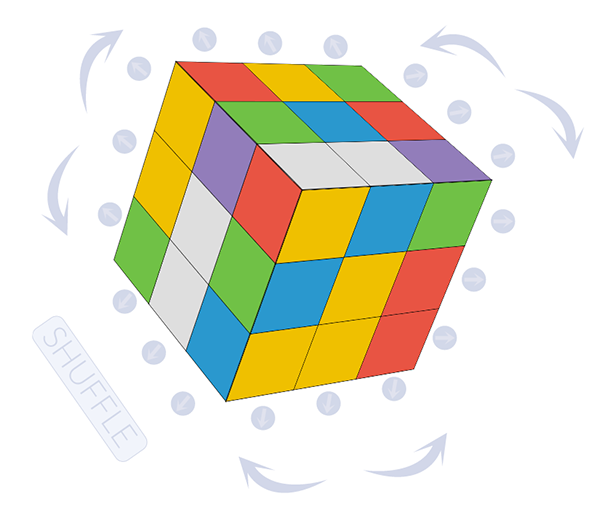

# Rubix - A Rubik's Cube with Redux


[Live Demo](https://zacqary.github.io/rubix)

This Rubik's cube uses React as a view, Redux and Saga as controllers, and is rendered entirely with CSS3 transforms.

**Works best in Chrome; some CSS animations have clipping issues in Firefox**

## Running
First:
```
npm install
```
To start:
```
npm start
```
and connect to
```
localhost:3000
```

## Playing
- Click **Shuffle** to mix up the cube
- Use the **large curved arrows** to rotate the whole cube
- Use the **small arrows** to rotate a section of the cube

This project was bootstrapped with [Create React App](https://github.com/facebookincubator/create-react-app).
